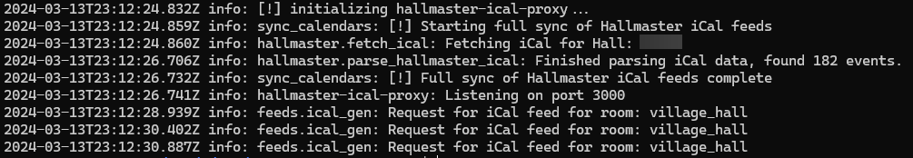

# hallmaster-ical-proxy

This tool works as a proxy between iCal-compatible systems and the Hallmaster V2 iCalStream API and provides multiple
calendars for individual rooms in your Hallmaster installation. This tool is specifically built for use with
Home Assistant at the iCal Sensor HACS integration by Tyler Britten 
(https://github.com/tybritten/ical-sensor-homeassistant)

## Development

This tool was built out of necessity, as individual calendars for rooms is not supported on Hallmaster. I don't have
a Hallmaster account to test development with at this time, so it's possible this tooling only works for the particular
instance of Hallmaster it's tested against.

## Monitoring

This tool provides a Prometheus metrics URL to monitor it's status, as well as logging
to the console and log files.

```
hallmaster_last_fetch_success - Set to 1 if the last fetch was successful, 0 if not.
hallmaster_last_fetch_time - Set to a timestamp of the last fetch, will likely be removed.
hallmaster_last_fetch_duration - Time the last fetch took, in milliseconds.
hallmaster_last_parse_success - Set to 1 if the last parse was successful, 0 if not.
hallmaster_last_parse_warning - Set to 1 if the last parse had a warning. (Usually a new room.)
hallmaster_events_in_feed - Number of events found in the calendar.
hallmaster_seconds_since_last_fetch - Seconds since the last fetch executed.
```

## Installation & Configuration

It's recommended this tool is run in a Docker container, a Dockerfile and example
docker-compose file has been provided.

### Configuration File

- Copy `config.example.yaml` to `config.yaml`.
- Set `hallmaster.hall_id` to the ID of your hall, you may need to get the iCal URL and extract it from that.
- Choose a cron schedule in `cron.sync_schedule` - it's set to 1 hour by default, this is how often the iCal is updated.
- Setup the rooms, see the next section

### Room Allocation

> NOTE: Rooms not defined in the config file will not be added to any calendars, they'll be ignored.

Each room must be assigned a slug, this should be something that can be included in a URL (i.e., URL safe.)
This would typically mean "Village Hall" becomes `vallage_hall`.

Once a slug has been decided, set this as the parent name under the `rooms` tree in the config file.
In the tree, define `name` with a friendly name. This **MUST** match the name used in Hall Master.

```yaml
village_hall:
  name: "Village Hall"
```

## Running with Docker

### Environment Variables

You may optionally set the following environment variables.

- `LOG_LEVEL` - A Winston-compatible log level, such as `debug`, `info`, `warn`, `error` (default `info`)
- `LISTEN_PORT` - Listening port for the HTTP service (default `3000`)

### Docker Compose
A docker-compose file has been provided, though it'll likely need some tweaking.

`docker-compose up -d`

### Docker

Build the image
`docker build -t hallmaster-ical-proxy`

Run the image

`docker run -d -p 3000:3000 --name hallmaster-ical-proxy -v $(pwd)/config.yaml:/app/config.yaml -v $(pwd)/logs:/app/logs hallmaster-ical-proxy`

## Running Manually
This project was built with the Bun Runtime, but doesn't use any Bun-specific features, so it should work with
any JavaScript runtime.

Specify your environment variables, prepare the config file and run with `bun run index.js`